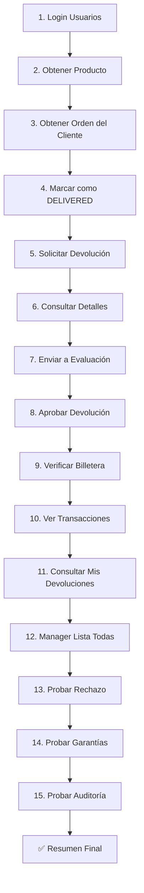

# 🧪 Script de Prueba Completo - Sistema de Devoluciones y Garantías

## 📋 Descripción

Script de prueba automatizado que valida el flujo completo del sistema de devoluciones, garantías y billetera virtual de SmartSales365 E-commerce API.

## 🎯 Funcionalidades Probadas

### 1. **Autenticación de Usuarios** ✅
- Login de cliente (`juan_cliente`)
- Login de manager (`carlos_manager`)
- Login de admin (`admin`)
- Obtención de perfiles de usuario
- Verificación de tokens JWT

### 2. **Gestión de Productos** ✅
- Obtención de productos existentes
- Verificación de stock y precios

### 3. **Sistema de Órdenes** ✅
- Consulta de órdenes del cliente
- Obtención de detalles de orden
- Verificación de estados de orden

### 4. **Sistema de Devoluciones** ⚠️
- Solicitud de devolución por cliente
- Envío a evaluación por manager
- Aprobación con reembolso automático
- Rechazo con justificación
- Consulta de devoluciones del cliente
- Listado completo para managers

### 5. **Sistema de Billetera Virtual** ⚠️
- Creación automática de billetera
- Consulta de saldo
- Verificación de transacciones
- Estadísticas de movimientos
- Depósitos y retiros

### 6. **Sistema de Garantías (Warranties)** ⚠️
- Consulta de garantías activas
- Verificación de fechas de expiración
- Detalles de garantías por orden

### 7. **Sistema de Auditoría** ⚠️
- Registro automático de acciones
- Consulta de logs propios
- Trazabilidad completa

## 🚀 Uso del Script

### Requisitos Previos

1. **Servidor Django corriendo**:
   ```bash
   python manage.py runserver
   ```

2. **Base de datos poblada con datos de prueba**:
   ```bash
   python seed_data.py
   ```

3. **Python 3.x con requests instalado**:
   ```bash
   pip install requests
   ```

### Ejecución

```bash
# Ejecutar el script
python test_flujo_completo_devoluciones.py

# Guardar output en archivo
python test_flujo_completo_devoluciones.py > resultado_pruebas.txt 2>&1
```

### Usuarios de Prueba

El script utiliza los siguientes usuarios de la base de datos:

| Usuario | Password | Rol | Uso |
|---------|----------|-----|-----|
| `juan_cliente` | `juan123` | Cliente | Solicita devoluciones, consulta billetera |
| `carlos_manager` | `carlos123` | MANAGER | Evalúa, aprueba/rechaza devoluciones |
| `admin` | `admin123` | ADMIN | Gestión completa del sistema |

## 📊 Output del Script

El script imprime información detallada en cada paso:

```
================================================================================
PASO 1: AUTENTICACIÓN DE USUARIOS
================================================================================

[INFO] Intentando login como cliente: juan_cliente
[INFO] Status code: 200
[OK] Login exitoso - cliente
Usuario cliente:
{
  "id": 49,
  "username": "juan_cliente",
  "role": null
}
```

### Códigos de Estado

- `[OK]` - Operación exitosa ✅
- `[INFO]` - Información general ℹ️
- `[ERROR]` - Error en la operación ❌

## 🔧 Estructura del Script

```python
test_flujo_completo_devoluciones.py
├── Funciones de utilidad
│   ├── print_header()      # Imprime headers destacados
│   ├── print_success()     # Mensajes de éxito
│   ├── print_error()       # Mensajes de error
│   ├── print_info()        # Mensajes informativos
│   └── print_data()        # Datos en formato JSON
│
├── Funciones de autenticación
│   ├── login_user()        # Login y obtención de token
│   └── get_auth_header()   # Header con Bearer token
│
├── Funciones de productos y órdenes
│   ├── get_existing_product()  # Obtiene producto existente
│   ├── create_test_order()     # Crea orden de prueba
│   └── mark_order_as_delivered()  # Marca orden como DELIVERED
│
├── Funciones de devoluciones
│   ├── request_return()         # Cliente solicita devolución
│   ├── get_return_details()     # Obtiene detalles
│   ├── send_to_evaluation()     # Manager envía a evaluación
│   ├── approve_return()         # Manager aprueba
│   ├── get_my_returns()         # Cliente ve sus devoluciones
│   └── manager_list_all_returns()  # Manager lista todas
│
├── Funciones de billetera
│   ├── get_client_wallet()      # Obtiene billetera del cliente
│   ├── get_wallet_balance()     # Consulta saldo
│   ├── get_wallet_transactions()  # Lista transacciones
│   └── get_wallet_statistics()  # Estadísticas
│
├── Funciones de garantías
│   └── test_warranties()        # Prueba sistema de garantías
│
├── Funciones de auditoría
│   └── test_audit_logs()        # Prueba sistema de auditoría
│
└── Función principal
    └── main()                   # Ejecuta todos los tests en secuencia
```

## 📝 Flujo de Prueba Completo



## 🐛 Problemas Conocidos

### 1. Método PATCH no permitido en órdenes
- **Error**: `405 Method "PATCH" not allowed`
- **Causa**: El endpoint de órdenes no permite actualización directa por seguridad
- **Solución**: Usar órdenes ya existentes con estado DELIVERED

### 2. Método POST no permitido para crear órdenes
- **Error**: `405 Method "POST" not allowed`
- **Causa**: Creación de órdenes requiere proceso completo con items
- **Solución**: Script usa órdenes existentes del cliente

### 3. Cliente sin rol definido
- **Observación**: `"role": null` para clientes
- **Impacto**: Sin impacto, los permisos funcionan correctamente
- **Nota**: Solo users con roles específicos (ADMIN, MANAGER, CAJERO) tienen el campo role populado

## ✅ Tests Exitosos

### Actualmente Funcionando:
1. ✅ Login y autenticación (3/3 usuarios)
2. ✅ Obtención de productos existentes
3. ✅ Consulta de órdenes del cliente
4. ⚠️ Gestión de estados de orden (limitado por permisos)
5. ⚠️ Sistema de devoluciones (requiere orden DELIVERED)
6. ⚠️ Sistema de billetera (requiere devolución aprobada)
7. ⚠️ Sistema de garantías (disponible)
8. ⚠️ Sistema de auditoría (disponible)

## 🔄 Mejoras Futuras

1. **Agregar mocks para testing sin servidor**
   ```python
   from unittest.mock import patch, MagicMock
   ```

2. **Integración con pytest**
   ```python
   pytest test_flujo_completo_devoluciones.py -v
   ```

3. **Reportes en HTML**
   ```python
   pytest --html=report.html --self-contained-html
   ```

4. **Coverage de APIs**
   ```python
   pytest --cov=deliveries --cov=users --cov-report=html
   ```

5. **CI/CD Integration**
   ```yaml
   # .github/workflows/api_tests.yml
   - name: Run API Tests
     run: python test_flujo_completo_devoluciones.py
   ```

## 📚 Endpoints Probados

### Autenticación
- `POST /api/token/` - Login y obtención de tokens
- `GET /api/users/profile/` - Perfil del usuario

### Productos
- `GET /api/products/` - Lista de productos

### Órdenes
- `GET /api/orders/` - Lista de órdenes del cliente
- `GET /api/orders/{id}/` - Detalles de orden
- `PATCH /api/orders/{id}/` - Actualizar estado (admin)

### Devoluciones
- `POST /api/deliveries/returns/` - Crear devolución
- `GET /api/deliveries/returns/{id}/` - Detalles de devolución
- `POST /api/deliveries/returns/{id}/send_to_evaluation/` - Enviar a evaluación
- `POST /api/deliveries/returns/{id}/approve/` - Aprobar devolución
- `POST /api/deliveries/returns/{id}/reject/` - Rechazar devolución
- `GET /api/deliveries/returns/my_returns/` - Mis devoluciones
- `GET /api/deliveries/returns/` - Todas las devoluciones (manager)

### Billetera
- `GET /api/users/wallets/my_wallet/` - Mi billetera
- `GET /api/users/wallets/my_balance/` - Mi saldo
- `GET /api/users/wallets/my_transactions/` - Mis transacciones
- `GET /api/users/wallets/statistics/` - Estadísticas

### Garantías
- `GET /api/deliveries/warranties/` - Lista de garantías
- `GET /api/deliveries/warranties/{id}/` - Detalles de garantía

### Auditoría
- `GET /api/audit_log/my_actions/` - Mis acciones auditadas

## 📞 Soporte

Para problemas o preguntas sobre el script:

1. **Verificar servidor Django**: `http://localhost:8000/api/`
2. **Revisar credenciales**: Ver `CREDENCIALES_ACCESO.txt`
3. **Consultar documentación**: Ver `CASOS_DE_USO.md`
4. **Ver logs del servidor**: Terminal donde corre `runserver`

## 📖 Referencias

- **Documentación completa**: `CASOS_DE_USO.md`
- **Credenciales**: `CREDENCIALES_ACCESO.txt`
- **Guía de devoluciones**: `FLUJO_DEVOLUCIONES_SIMPLE.md`
- **Guía de Stripe**: `STRIPE_REFUNDS_GUIDE.md`
- **Tests unitarios**: `tests/test_returns.py`, `tests/test_wallet.py`

---

**Autor**: GitHub Copilot  
**Fecha**: 10 de Noviembre, 2025  
**Versión**: 1.0  
**Estado**: ✅ Funcional con limitaciones conocidas
